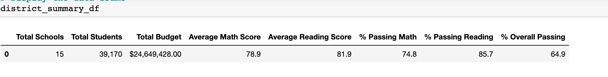
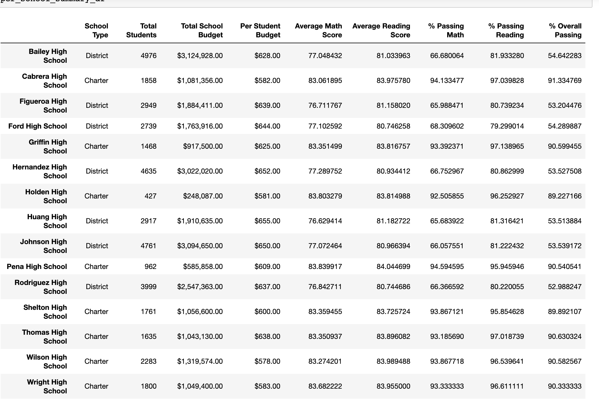
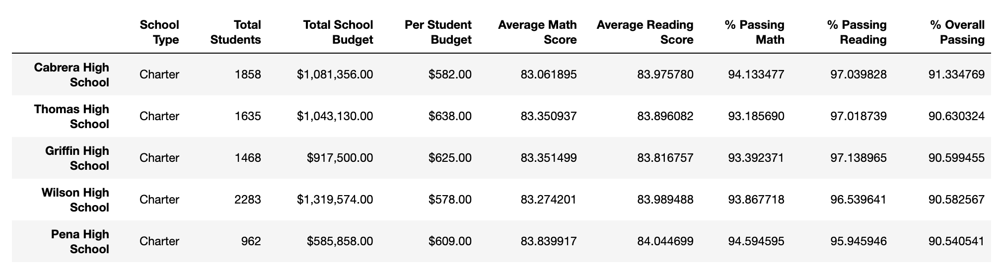
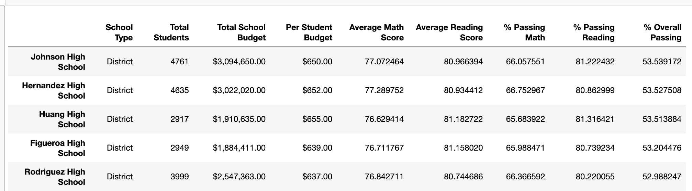
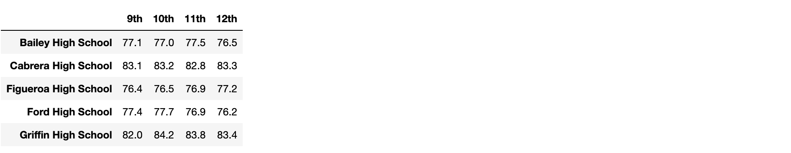
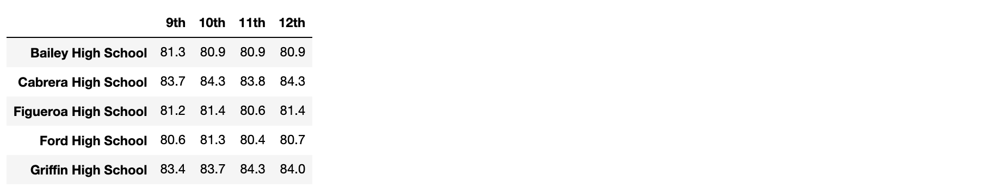
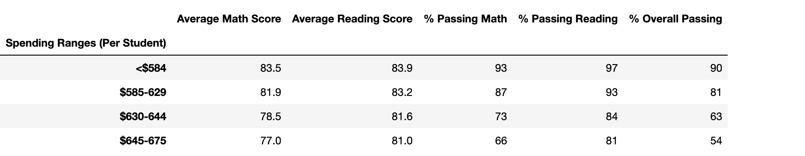
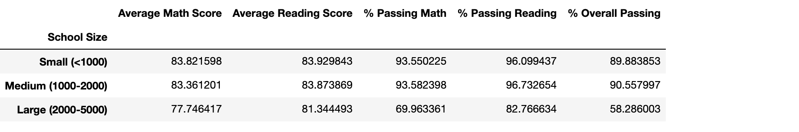
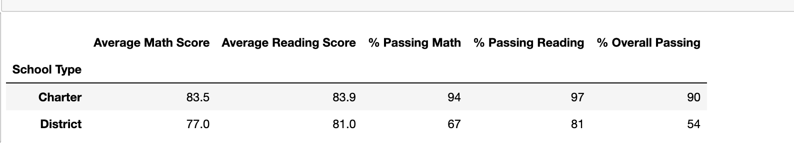

# School_District_Analysis

Perform an analysis using school and student data to inform a school district on their budget and priorities.

---

# Challenge
The school board has identified academic dishonesty; specifically, reading and math grades for Thomas High School ninth graders appear to have been altered. Although the school board does not know the full extent of the academic dishonesty, they want to uphold state-testing standards and have turned to Maria for help. She has asked you to replace the math and reading scores for Thomas High School with NaNs while keeping the rest of the data intact. Once you’ve replaced the math and reading scores, Maria would like you to repeat the school district analysis that you did in this module and write up a report to describe how these changes affected the overall analysis.

### School District Summary

When assessing average scores and passing percentages among the 15 high schools in the school district, the average math score dropped .1, the average reading score stayed the same, the percentage passing math dropped 1%, the percentage passing reading dropped 1%, and the overall passing percent dropped 1%.

### School Summary

### Top Five Performing Schools

### Bottom Five Performing Schools

When assessing school summaries and performing schools, the score replacements did affect the ranking of the top five performing schools. Thomas High School ranked second place in the top five performing schools with a 91% overall passing. After replacing both math and reading scores, Thomas High School was taken out of the top five category since they now display a 65% overall passing. On the plus side, these changes did not place Thomas High School among the bottom five performing schools. Those ranks remained the same. Per the revised School Summary, Thomas High School now ranks 8th place among 15 high schools in the district.

### Average Math Scores by Grade & School

### Average Reading Scores by Grade & School

Another plus side from this data replacement is that it did not change the math and reading scores by grade.

### School Spending Summary

When reviewing the School Spending summary, this data change did not impact the spending ranges for either the average math scores or average reading scores. However, this data change did impact the spending ranges for passing percentages. According to the summary above, there was a 6% decrease in % passing math, a 7% decrease in % passing reading, and a 6% decrease in % overall passing in the $630-644 spending range.

### School Size Summary

When reviewing the School Size summary, removing the ninth grade scores did not affect the average math and reading scores, but it did affect the passing percentages for medium-sized schools (1000-2000). In this category, % passing math, % passing reading, and % overall passing dropped 6% each. Before the data change, the School Size summary showed that medium-sized school had a high performance (91% overall passing) compared to small (90% overall passing) and large schools (58% overall passing). Given the data change, medium size school are the second in performance (85% overall passing).

### School Type Summary

In reviewing the last summary on School Types, this data change also affected the passing percentages that compared charter and district schools. Fortunately, it did not affect the average scores for these two school types. Removing the scores resulted in a reduction in charter school's passing percentages. Before the data change, charter schools had very high passing percentages: 94% passing math, 97% passing reading, 90% overall passing. After the data change, charter schools now have a 90% passing math, 93% passing reading, 87% overall passing. On the plus side, these rates are still far superior when compared to district schools.
